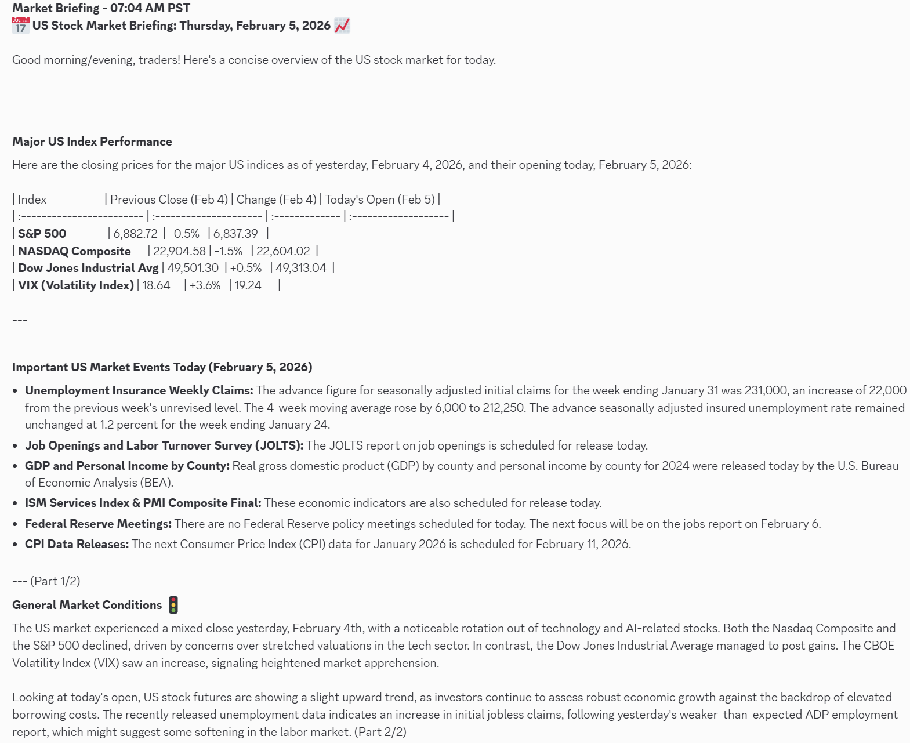
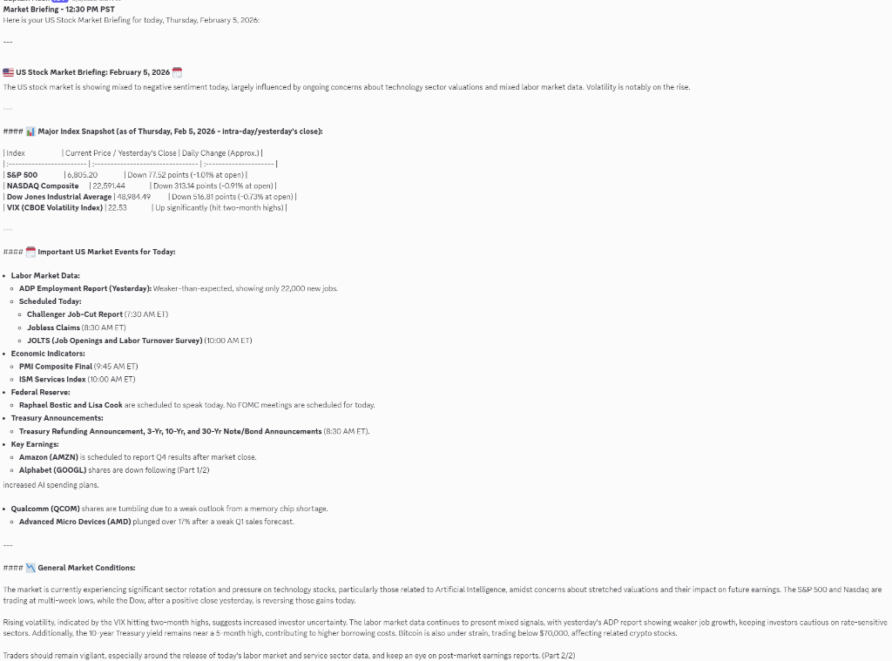
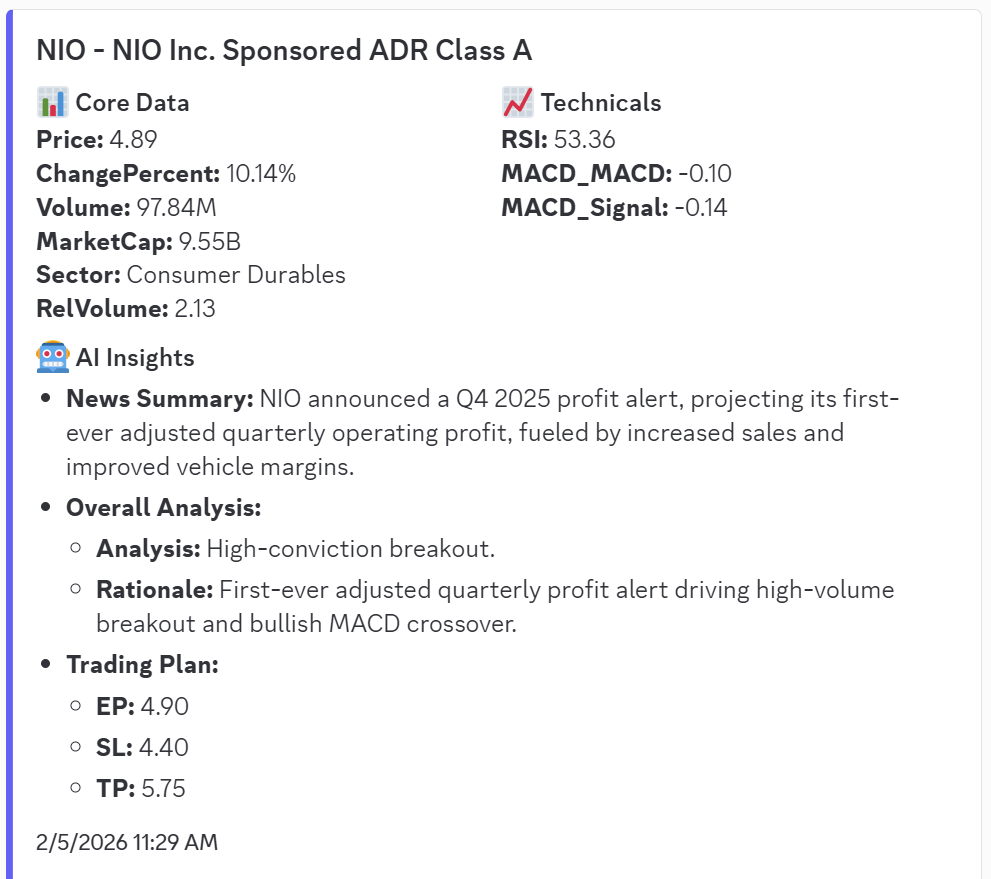
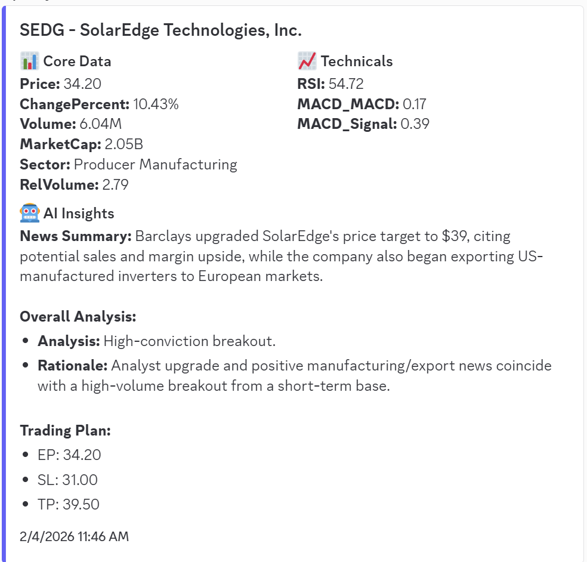

# 📈 BreakoutAnalysis

### *Know what's moving in the stock market — before everyone else does.*

BreakoutAnalysis is an automated stock alert system that wakes up every morning, scans thousands of US stocks, finds the ones making big moves, and delivers a rich briefing straight to your Discord or a list of emails — complete with AI-generated analysis, news headlines, and chart screenshots.

No more staring at a screen all day. Just open Discord and see what's worth paying attention to.

---

## 🔍 What Is a Breakout?

A **breakout** happens when a stock makes a sudden, decisive move — typically a sharp price increase on high trading volume. Breakouts matter because they often signal that something significant is happening: an earnings beat, a product launch, a buyout rumor, or a shift in market sentiment.

The key signals of a real breakout (vs. random noise):
- 📈 **Big price move** — the stock is up significantly today (e.g. 6%+)
- 🔊 **Unusually high volume** — far more shares are trading than normal (2-3x average)
- 💰 **Real company** — not a penny stock or micro-cap that moves on air

BreakoutAnalysis screens for exactly these characteristics, every 15 minutes during market hours.

---

## 🧠 How It Works

```
 ┌─────────────────────────────┐
 │   TradingView Screener      │  Scans thousands of US stocks
 │  (market + pre-market)      │  in real time
 └────────────┬────────────────┘
              │  Stocks passing filters
              ▼
 ┌─────────────────────────────┐
 │   Alpaca Historical Data    │  Checks: is this stock actually
 │   Quality Filter            │  strong over the past 1-5 years?
 └────────────┬────────────────┘
              │  High-quality breakout candidates
              ▼
 ┌─────────────────────────────┐
 │   AI Analysis (Gemini/GPT)  │  Writes a plain-English summary
 │   + News Collection         │  of why it's moving
 └────────────┬────────────────┘
              │
              ▼
 ┌─────────────────────────────┐
 │   Discord & Email Alerts    │  Sends rich notifications with
 │   + Chart Screenshots       │  charts, news, and AI analysis
 └─────────────────────────────┘
```

---

## 🔧 What Does "Detect Breakout" Mean Here?

BreakoutAnalysis identifies breakout candidates using **configurable filters** applied in two stages:

### Stage 1 — Screener Filters *(applied in real-time via TradingView)*

These are the basic criteria a stock must pass to even be considered:

| Filter | Default | What it means |
|--------|---------|---------------|
| **Min % Change** | +6% | Stock is up at least 6% today |
| **Min Volume** | 1,000,000 | At least 1 million shares traded |
| **Min Relative Volume** | 2× | Trading 2× more than its 10-day average |
| **Price Range** | $0.50 – $100 | Avoids penny stocks and extremely high-priced shares |
| **Market Cap (non-tech)** | $200M+ | Filters out most micro-cap noise |

For **large-cap stocks (>$10B market cap)**, the min change is 6%.
For **smaller stocks**, the bar is set higher at 10% — because a small stock needs a stronger move to signal a real breakout.

### Stage 2 — Historical Quality Filter *(powered by Alpaca)*

After stage 1, the system checks each stock's **1-year and 5-year price history**. Stocks with weak long-term performance are filtered out — this helps avoid "junk" movers that spike and crash repeatedly.

> **You can adjust all of these filters** in `config/config.json` under `screeners.filters`.
> No coding needed — just change the numbers and restart the bot.

---

## 🛠️ The Tools Behind It

### TradingView
[TradingView](https://tradingview.com) is the world's most popular stock charting and screening platform, used by millions of traders. BreakoutAnalysis uses TradingView's screener API to scan the entire US market in seconds — the same data professional traders use.

- **Market Screener** — scans during regular market hours (9:30 AM – 4:00 PM ET)
- **Pre-Market Screener** — scans before the bell (4:00 AM – 9:30 AM ET) to catch early gappers
- Optional: TradingView account for **chart screenshots** sent with each alert (see Setup)

### Alpaca
[Alpaca](https://alpaca.markets) is a commission-free brokerage and market data provider with a free developer API. BreakoutAnalysis uses Alpaca for two things:

1. **Historical stock data** — to filter out weak performers and confirm a stock has real strength over time
2. **Current quote data** — to verify live prices before sending an alert

Alpaca has a **free tier** (IEX feed — works great for screening) and a **premium tier** (SIP feed — consolidated data from all US exchanges, recommended for best accuracy).

| Alpaca Plan | Cost | Data Coverage |
|-------------|------|--------------|
| Free | $0 | IEX exchange only — good for getting started |
| Algo Trader | ~$9/mo | **SIP — all US exchanges** ⭐ Recommended |

### AI Analysis (Gemini / GPT)
Each breakout candidate gets analyzed by an AI model that reads real-time news and writes a concise explanation of *why* the stock is moving, what levels to watch, and key risks. Supports:
- **Google Gemini** (free tier available at [aistudio.google.com](https://aistudio.google.com))
- **OpenAI GPT-4** (paid, at [platform.openai.com](https://platform.openai.com))
- **Local models** via Ollama (Llama 3.2 Vision, DeepSeek-R1 — runs on your own machine, no API key)

### Discord
Each breakout triggers a rich Discord notification with the ticker, price, % change, volume, sector, AI analysis, news headlines, and a TradingView chart image. One channel for individual stock alerts, another for the daily market briefing.

---

## 💬 What You Get

**☀️ Morning Market Briefing** — before the market opens, a Gemini-powered summary lands in your Discord and email covering S&P 500, NASDAQ, Dow, VIX, and any key events for the day (Fed meetings, CPI releases, earnings, etc.).

**🌇 Afternoon Market Briefing** — midday, a second briefing recaps how the session is unfolding and what to watch for the rest of the day.

**📧 Morning Email Digest (7–8 AM PST)** — a curated email of the top breakout stocks detected since the pre-market open, with AI analysis, news, and chart images.

**📧 Afternoon Email Digest (12–1 PM PST)** — a second batch covering any new breakouts detected during the morning session that weren't in the first email.

**During market hours** (every 15 minutes): **Discord Stock Alerts** for every new breakout candidate detected:

```
📊 TICKER  +12.4% | $45.20 | Vol: 8.2M (3.4×)
Sector: Technology | Market Cap: $2.1B

🤖 AI Analysis:
TICKER is surging after announcing a partnership with...
Key resistance at $48. Watch volume at the open...

📰 News:
  • "TICKER soars 12% on major partnership deal" — Bloomberg
  • "Analysts upgrade TICKER to Buy" — Reuters

📷 [TradingView Chart Image]
```

---

## � Screenshots

### ☀️ Morning Market Briefing


### 🌇 Afternoon Market Briefing


### 📊 Stock Alert — Discord Card





See **[SETUP.md](SETUP.md)** for a full step-by-step guide.

**The short version:**
```bash
git clone https://github.com/your-username/BreakoutAnalysis.git
cd BreakoutAnalysis
pip install -r requirements.txt
playwright install chromium
cp config/config.example.json config/config.json
# Edit config/config.json with your credentials
python src/tradealerts.py
```

**Minimum requirements to get started:**
- Free [Alpaca](https://alpaca.markets) account + API key
- Free [Google AI Studio](https://aistudio.google.com) API key (Gemini)
- Discord server with a webhook URL

**Optional (adds more value):**
- TradingView account (for chart screenshots)
- Gmail OAuth credentials (for email alerts)
- Alpaca premium plan for SIP feed (better data accuracy)

---

## ⚙️ Configuration Reference

All settings are in `config/config.json`. Copy `config/config.example.json` to get started.

### Screener Filters
```json
"filters": {
    "min_change_percent": 6,
    "min_volume": 1000000,
    "min_price": 0.50,
    "max_price": 100,
    "min_relative_volume": 2,
    "large_cap_threshold": 10000000000,
    "large_cap_min_change_percent": 6,
    "small_cap_min_change_percent": 10,
    "min_market_cap_non_tech": 200000000
}
```

### Environment Variables
For running in Docker or on a server without editing files:

| Variable | What it sets |
|----------|-------------|
| `ALPACA_API_KEY` | Alpaca API key |
| `ALPACA_API_SECRET` | Alpaca API secret |
| `ALPACA_DATA_FEED` | `sip` or `iex` |
| `GEMINI_API_KEY` | Google Gemini API key |
| `OPENAI_API_KEY` | OpenAI API key |
| `DISCORD_WEBHOOK_URL` | Discord stock alerts webhook |
| `DISCORD_REPORT_WEBHOOK_URL` | Discord market report webhook |
| `TV_CHART_ID` | TradingView chart ID for screenshots |

---

## 🔌 Optional Integrations

Everything is modular. The bot runs even if some pieces aren't configured:

| Integration | Required? | Without it |
|-------------|-----------|-----------|
| Alpaca API | Optional | Screener runs; historical quality filter skipped |
| LLM (Gemini/OpenAI) | Optional | Alerts sent without AI write-up |
| Discord | Optional | No Discord notifications |
| TradingView account | Optional | No chart screenshots |
| Gmail OAuth | Optional | No email notifications |

---

## 📁 Project Structure

```
BreakoutAnalysis/
├── config/
│   ├── config.example.json   ← Template — copy to config.json and fill in
│   └── config.json           ← Your credentials (never committed to git)
├── src/
│   ├── tradealerts.py        ← Main script — run this
│   ├── screeners/            ← TradingView market & pre-market screeners
│   ├── utils/                ← Alpaca client, config loader
│   ├── llms/                 ← AI model integrations
│   ├── notifications/        ← Discord alerts
│   ├── screenshotapi/        ← TradingView chart screenshots
│   ├── newscollector/        ← News headline fetching
│   └── email/                ← Gmail alert sending
├── SETUP.md                  ← Step-by-step setup guide
├── CONTRIBUTING.md
├── DISCLAIMER.md
└── requirements.txt
```

---

## ⚠️ Disclaimer

This tool is for **informational and educational purposes only**. It does not place trades on your behalf and is not financial advice. Past breakout signals do not guarantee future results. See [DISCLAIMER.md](DISCLAIMER.md) for full details.

---

## 📄 License

MIT License — see [LICENSE](LICENSE). Free to use, modify, and share.
